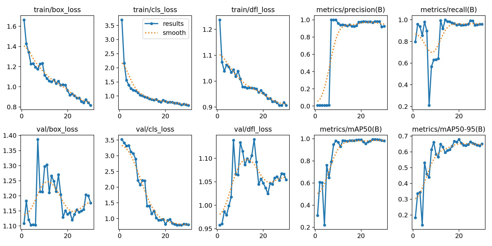

# 🟡🔵 Cone Detection Model using YOLOv8

This project features a trained **YOLOv8 object detection model** designed to detect **blue and yellow traffic cones** in images. The model is lightweight, accurate, and suitable for autonomous navigation.
## 🎯 Model Description

- **Model**: YOLOv8n (Nano version)
- **Classes**: `blue_cone`, `yellow_cone`
- **Input Size**: 640×640 pixels
- **Model Size**: ~6 MB (`best.pt`)
- **Framework**: [Ultralytics YOLOv8](https://github.com/ultralytics/ultralytics)
- **Format**: PyTorch `.pt` checkpoint

The model was trained using a custom dataset with annotated images containing cones in indoor environments, under varying lighting and angles. Data augmentation was applied to improve generalization.

---

## 📈 Model Performance

| Metric              | Value     |
|---------------------|-----------|
| mAP@0.5             | ~95%      |
| mAP@0.5:0.95        | ~68%      |
| Precision           | High, stable after epoch 10 |
| Recall              | High, with minor early fluctuation |
| Inference Speed     | ~150 ms/image (Colab GPU) |

---

*Figure: Training curves showing loss convergence, mAP, precision, and recall over 30 epochs.*

---

## 📦 Output

The trained model can be used to:
- Detect cones in real-time image or video streams
- Support autonomous navigation or lane marking in robotics
- Serve as a lightweight object detector on edge devices

---
