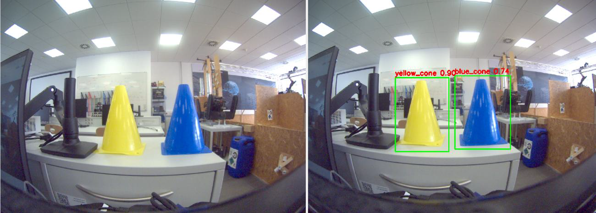

## 📦 cone_detector

`cone_detector` implements a real-time traffic cone detection pipeline using **YOLOv8**, supporting autonomous navigation tasks like track following and cone-based path planning in Formula Student scenarios.

---

### 🧠 Core Features

- Detects and classifies **blue** and **yellow** cones
- Uses YOLOv8 for high-speed, accurate inference
- Publishes annotated images with bounding boxes

---

### 🔁 Function

- **Subscribed Topic:** `/image_raw` (`sensor_msgs/msg/Image`)  
- **Published Topic:** `/detections/annotated_image` (YOLO output)

---

### 🚀 Run the Node

```bash
ros2 run cone_detector yolo_node.py
```
### Cone Detection Example

---
